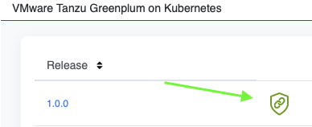

# GPDB on K8s
Instructions to run Greenplum Database (GPDB) in Kubernetes (K8s).  We will be deploying GPDB to K8s locally on your laptop using the GPDB Operator which, by default, deploys one controller and one segment (as pods/containers).  The GPDB images require an x86_64 architecture.  On ARM based Macs we will be using Colima and QEMU, which provides emulation for ARM.  For Intel based Macs emulation won’t be needed and K8s can be used directly, i.e., via Kind or Minikube (Colima works here too).

# Mac/OSX Setup
The below will work on both ARM and Intel based Macs.  If you are running an Intel based Mac you can alternatively use other K8s deployments, i.e., Kind or MiniKube, instead of Colima below.  Also, if you have an Intel based K8s deployment running elsewhere (e.g., in a lab) you can use that instead of a local Colima deployment.

## Prerequisits
1. Docker (client) installed (e.g., Homebrew or [Docker Desktop](https://www.docker.com/products/docker-desktop/)) (podman *'should'* also work)
```shell
brew install docker
```
2. Fully shutdown Docker/Podman (e.g., `Quit Docker Desktop` from the menu bar). It will conflict if running, but the client libraries must still be installed in the above step.
3. kubectl installed (e.g., Homebrew)
```shell
brew install kubectl
```
4. Install Colima & QEMU: (e.g., Homebrew)
```shell
brew install qemu colima lima-additional-guestagents
```
5. Install Helm (e.g., Homebrew)
```shell
brew install helm
```
6. Install the psql CLI (e.g., Homebrew)
  - You can install it with Postgres (or if you already have postgres you should already have psql)
```shell
brew install postgresql@17
```
  - Or you can install it standalone via libpq
```shell
brew install libpq
brew link --force libpq # not done by default
```

## Export Your Repository Credentials
1. Login to [support.broadcom.com](http://support.broadcom.com)
2. Select 'My Downloads'
3. Search for Greenplum and Select ["VMware Tanzu Greenplum on Kubernetes"](https://support.broadcom.com/group/ecx/productdownloads?subfamily=VMware%20Tanzu%20Greenplum%20on%20Kubernetes)
4. Expand (click on the right arrow '>') "VMware Tanzu Greenplum on Kubernetes"
5. Click on the Green Sheild for the release (e.g., "1.0.0")

6. View your Repository Credentials 
7. Export your Credentials
```shell
export GPDB_REPO_USER='user.email@company.com'
```
```shell
export GPDB_REPO_PASSWORD='****'
```

## Run K8s in Colima
1. Start Colima
```shell
colima start --arch x86_64 --kubernetes --cpu 6 --memory 6
```
   - I suggest using 6 cores and 6GB or RAM with Colima but you can adjust as needed. 
   - If this fails make sure you have ‘lima-additional-guestagents’ installed and docker is NOT actively running on your laptop (must be installed, but not running)
2. Validate K8s is up and running 
```shell
kubectl get nodes
```

## Deploy GPDB Operator
[Official Docs Here](https://techdocs.broadcom.com/us/en/vmware-tanzu/data-solutions/tanzu-greenplum-k8s/1-0/tgp-on-k8s/04-installation.html) (for reference)

Simple Lab Instructions:
1. Create a new namespace
```shell
kubectl create ns gpdb
```
2. Install Cert Manager
```shell
kubectl apply -f https://github.com/cert-manager/cert-manager/releases/download/v1.18.2/cert-manager.yaml
```
3. Helm Login to the Repo
```shell
helm registry login -u $GPDB_REPO_USER -p $GPDB_REPO_PASSWORD tanzu-greenplum.packages.broadcom.com
```
4. Set Docker Secret for the Repo
```shell
kubectl create secret docker-registry image-pull-secret -n gpdb --docker-server=tanzu-greenplum.packages.broadcom.com --docker-username=$GPDB_REPO_USER --docker-password=$GPDB_REPO_PASSWORD
```
5. Clone this Git Repository
```shell
git clone https://github.com/dbeauregard/gpdb-k8s.git
cd gpdb-k8s
```
6. Helm Deploy the GPDB Operator (uses the [values.yaml](values.yaml) in this repo.  Take a look!)
```shell
helm install gp-operator oci://tanzu-greenplum.packages.broadcom.com/gp-operator-chart/gp-operator --version 1.0.0 -n gpdb -f values.yaml
```
7. Wait until the pod is ready (1/1) and RUNNING
```shell
kubectl get po -n gpdb #add ‘-w’ to watch
```
  - details
    ```shell
    kubectl describe po gp-operator-controller-manager-<guid> -n gpdb
    ```

## Deploy GPDB Cluster
1. Create the Greenplum Version (uses [gpversion-7_5_2.yaml](gpversion-7_5_2.yaml). Take a look!)
```shell
kubectl apply -f gpversion-7_5_2.yaml -n gpdb
```
2. Validate the Greenplum Version
```shell
kubectl get greenplumversion -n gpdb
```
3. Create the GPDB Minimal Cluster (uses [gp-minimal.yaml](gp-minimal.yaml). Take a look!)
```shell
kubectl create -f gp-minimal.yaml -n gpdb 
```
4. Check the status of the GP instances and pods.  Wait for them to be running.
```shell
kubectl get pods -n gpdb #add ‘-w’ to watch
```
```shell
kubectl describe pod <pod name> -n gpdb
```
  - If you see an error about an unbound PVC (“pod has unbound immediate PersistentVolumeClaims”) you may need to modify the storageclass name in gp-minimal.yaml (2 places) and redeploy
  - Run `kubectl get pv,pvc,sc -n gpdb` to see the status and get the default storage class name.  It may be ‘local-path’, ‘standard’, ‘default’, etc.
6. You can also watch the operator logs with `k logs gp-operator-controller-manager-<guid> -n gpdb` (add ‘-f’ at the end to tail the logs) 
7. Wait until the GP instance is 'READY' (this can take ~10min)
```shell
kubectl get gp -n gpdb
```

## Connect with PSQL
1. Locally:  (if postgres is running on your local machine the port 5432 will conflict and need to be changed in the below)
```shell
kubectl port-forward gp-minimal-coordinator-0 5432:5432 -n gpdb #you can port-forward to different port if needed
```
  - in another terminal tab/window
```shell
psql postgres -h localhost -U gpadmin
```
  - You won’t need a password but for reference they are in the secret `gp-minimal-creds`
2. OR Exec into the Container:
```shell
kubectl exec -it gp-minimal-coordinator-0 -n gpdb -- /bin/bash
psql postgres
```
3. In psql you can list the databases with `\l`, get help with `\?`, and exit with `\q`
4. See [data.md](data.md) for more SQL and a simple example

## Deploy Greenplum Command Center (GPCC) (Optional)
**This is currently not working for me**
1. Create the GPCC instance (uses [gpcc-minimal.yaml](gpcc-minimal.yaml). Take a look!)
```shell
kubectl create -f gpcc-minimal.yaml -n gpdb
```
2. Check the pod status
```shell
kubectl get pods -n gpdb 
```
3. Check the GPCC status
```shell
kubectl get gpcc -n gpdb
```
4. Get GPCC user credentials 
   - The Username will be: “gpmon“
   - For the Password run:
    ```shell
    kubectl get secret gpcc-cc-creds -n gpdb -o jsonpath='{.data.*}' | base64 -d #ignore any shell appended % signs
    ```
5. Port-forward gpcc service to access gpcc locally 
```shell
kubectl port-forward svc/gpcc-cc-svc -n gpdb 8080:8080
```
6. In a browser navigate to the url http://127.0.0.1:8080 and login

## Cleanup
1. Stop Colima (pauses Colima and the K8s cluster; can be restarted later)
```shell
colima stop
```
2. Delete Colima (deletes the Colima deployment and K8s cluster)
```shell
colima delete
```